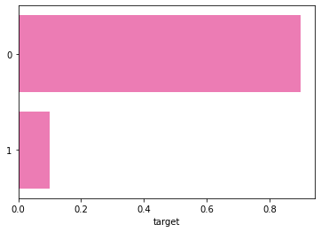
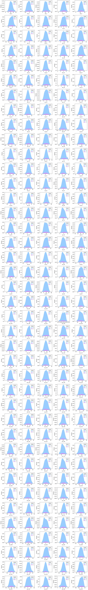
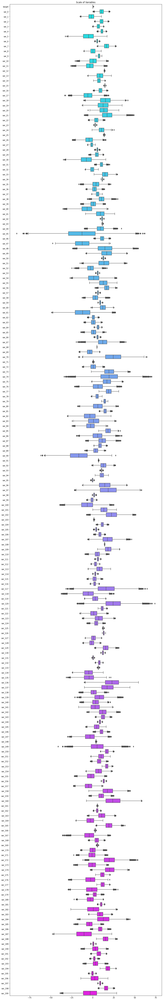
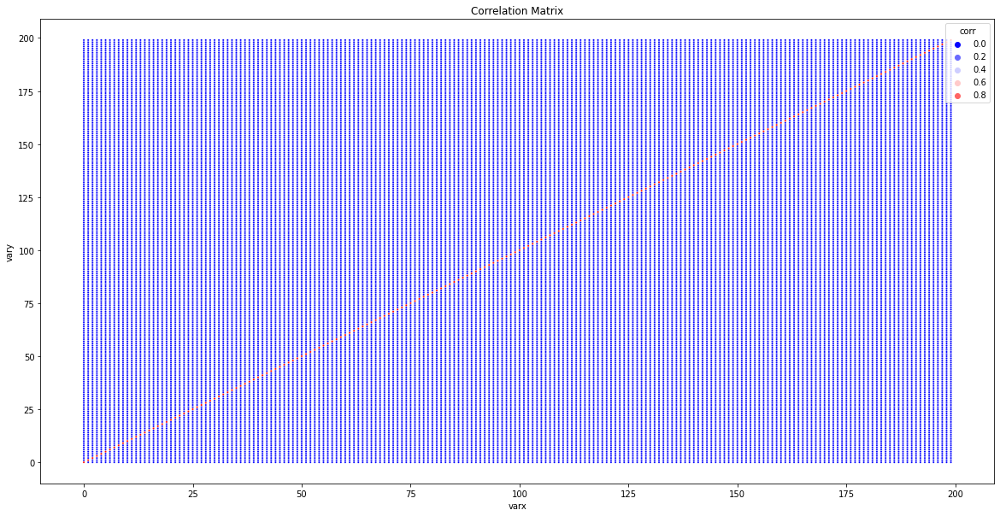
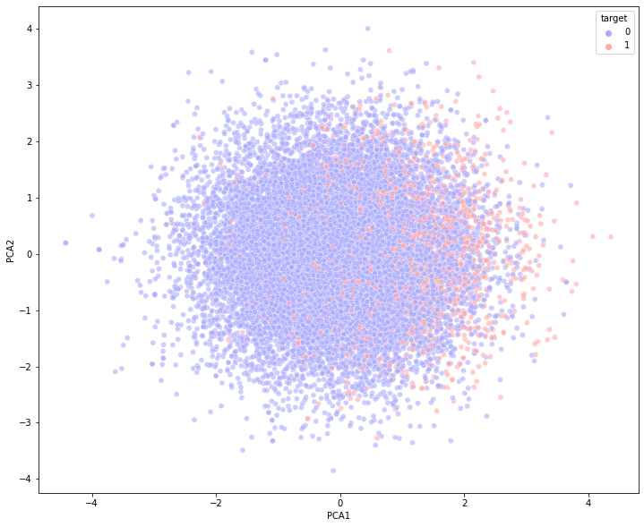

## **Exploratory Data Analysis**

### **TABLE OF CONTENT**

1. Importing Data
2. Frequency of Target class
3. Distribution of features
4. Dispersion of features
5. Correlation among features
6. Clustering using PCA
7. Implementing baseline model


```python
import numpy as np
import pandas as pd
import matplotlib.pyplot as plt
import seaborn as sns
```

### **Importing Data**

*Since we have saved our data in a pickle file with custom datatype to quickly import the data and save the space in the memory*


```python
df_train = pd.read_pickle("data/train.pickle")
```

*The data consist of 201 columns out of which 200 are continuous varibles while one column consist of target categorical variables.The
number of samples in our data is two hundred thousand.*


```python
df_train.tail()
```


<div>
<table border="1" class="dataframe">
  <thead>
    <tr style="text-align: right;">
      <th></th>
      <th>target</th>
      <th>var_0</th>
      <th>var_1</th>
      <th>var_2</th>
      <th>var_3</th>
      <th>var_4</th>
      <th>var_5</th>
      <th>var_6</th>
      <th>var_7</th>
      <th>var_8</th>
      <th>...</th>
      <th>var_190</th>
      <th>var_191</th>
      <th>var_192</th>
      <th>var_193</th>
      <th>var_194</th>
      <th>var_195</th>
      <th>var_196</th>
      <th>var_197</th>
      <th>var_198</th>
      <th>var_199</th>
    </tr>
  </thead>
  <tbody>
    <tr>
      <th>199995</th>
      <td>0</td>
      <td>11.4880</td>
      <td>-0.4956</td>
      <td>8.2622</td>
      <td>3.5142</td>
      <td>10.3404</td>
      <td>11.6081</td>
      <td>5.6709</td>
      <td>15.1516</td>
      <td>-0.6209</td>
      <td>...</td>
      <td>6.1415</td>
      <td>13.2305</td>
      <td>3.9901</td>
      <td>0.9388</td>
      <td>18.024900</td>
      <td>-1.7939</td>
      <td>2.1661</td>
      <td>8.5326</td>
      <td>16.6660</td>
      <td>-17.8661</td>
    </tr>
    <tr>
      <th>199996</th>
      <td>0</td>
      <td>4.9149</td>
      <td>-2.4484</td>
      <td>16.7052</td>
      <td>6.6345</td>
      <td>8.3096</td>
      <td>-10.5628</td>
      <td>5.8802</td>
      <td>21.5940</td>
      <td>-3.6797</td>
      <td>...</td>
      <td>4.9611</td>
      <td>4.6549</td>
      <td>0.6998</td>
      <td>1.8341</td>
      <td>22.271700</td>
      <td>1.7337</td>
      <td>-2.1651</td>
      <td>6.7419</td>
      <td>15.9054</td>
      <td>0.3388</td>
    </tr>
    <tr>
      <th>199997</th>
      <td>0</td>
      <td>11.2232</td>
      <td>-5.0518</td>
      <td>10.5127</td>
      <td>5.6456</td>
      <td>9.3410</td>
      <td>-5.4086</td>
      <td>4.5555</td>
      <td>21.5571</td>
      <td>0.1202</td>
      <td>...</td>
      <td>4.0651</td>
      <td>5.4414</td>
      <td>3.1032</td>
      <td>4.8793</td>
      <td>23.531099</td>
      <td>-1.5736</td>
      <td>1.2832</td>
      <td>8.7155</td>
      <td>13.8329</td>
      <td>4.1995</td>
    </tr>
    <tr>
      <th>199998</th>
      <td>0</td>
      <td>9.7148</td>
      <td>-8.6098</td>
      <td>13.6104</td>
      <td>5.7930</td>
      <td>12.5173</td>
      <td>0.5339</td>
      <td>6.0479</td>
      <td>17.0152</td>
      <td>-2.1926</td>
      <td>...</td>
      <td>2.6840</td>
      <td>8.6587</td>
      <td>2.7337</td>
      <td>11.1178</td>
      <td>20.415800</td>
      <td>-0.0786</td>
      <td>6.7980</td>
      <td>10.0342</td>
      <td>15.5289</td>
      <td>-13.9001</td>
    </tr>
    <tr>
      <th>199999</th>
      <td>0</td>
      <td>10.8762</td>
      <td>-5.7105</td>
      <td>12.1183</td>
      <td>8.0328</td>
      <td>11.5577</td>
      <td>0.3488</td>
      <td>5.2839</td>
      <td>15.2058</td>
      <td>-0.4541</td>
      <td>...</td>
      <td>8.9842</td>
      <td>1.6893</td>
      <td>0.1276</td>
      <td>0.3766</td>
      <td>15.210100</td>
      <td>-2.4907</td>
      <td>-2.2342</td>
      <td>8.1857</td>
      <td>12.1284</td>
      <td>0.1385</td>
    </tr>
  </tbody>
</table>
<p>5 rows × 201 columns</p>
</div>


### **Frequency of Target class**

*The target class in unbalanced with almost `ninty percent` of target class belong to class 0 and rest `ten percent` belong to class
1,Thus we have to take care of the unblanced data since our target is to classify category 1 as precisely as possible* 


```python
print(df_train['target'].value_counts()/len(df_train))
sns.barplot(x=df_train['target'].value_counts()/len(df_train), y=df_train['target'].value_counts().index,
            color="hotpink", orient="h");
```

    0    0.89951
    1    0.10049
    Name: target, dtype: float64





### **Distribution of features**

*The distribution of features seems to closely follow Normal Disrtibution but as we can see from the distribution of the data, category 0 is highly `leptokurtic` while category 1 distribution is highly `platykurtic` in nature*


```python
fig, axes = plt.subplots(40,5,figsize=(15,100))
col = df_train.columns[1:]
x = 0
for i in range(40):
    for j in range(5):
        sns.kdeplot(ax=axes[i,j],x =df_train[col[x]], y=None, hue = df_train["target"],
                    linewidth=0,fill=True, palette="cool", alpha= 0.6, multiple="stack")
        x = x + 1
plt.tight_layout();
```





### **Dispersion of features**

*As we can see there is wide variety of features with different scales and dispersion from the boxplots.*


```python
plt.figure(figsize=(15, 100))
ax = sns.boxplot(data=df_train, orient="h", palette="cool")
ax.set_title("Scale of Variables");
```





### **Correlation among features**

*As from the heatmap we can observe the all the feature have extremely low correlation with each other. Therefore from the initial 
assessmet of correlation matrix we can deduce that all variables are highly important and need to be taken in consideration 
while we implement them in  model.*


```python
from sklearn.preprocessing import StandardScaler

scalar = StandardScaler()
X = df_train.iloc[:,1:]
X.columns = range(200)
y = df_train["target"]
df_scaled = scalar.fit_transform(X)
```


```python
corr_matrix = X.corr()
corr_matrix = corr_matrix.stack().reset_index()
corr_matrix.columns = ["varx", "vary", "corr"]
plt.figure(figsize=(20,10))
ax = sns.scatterplot(data=corr_matrix, x="varx", y="vary", hue="corr", palette="bwr", s=5)
ax.set_title("Correlation Matrix");
```





### **Clustering using PCA**

*As we can observe from the boxplots that our data have different scales we need to scale our data before implementing  
Principal Component analysis. After Scaling data and implementing PCA we can observe that category 0 is  clustered at 
the center while category 1 is clustered,  slightly right of the x-axis*


```python
from sklearn.decomposition import PCA

pca = PCA(n_components=2)
comp = pca.fit_transform(df_scaled)
sample_index = np.random.choice(200000, size = 20000)
sample_comp = comp[sample_index]
sample_target = y[sample_index]

plt.figure(figsize=(12,10))
ax = sns.scatterplot(x=sample_comp.T[0], y=sample_comp.T[1], hue=sample_target, palette="bwr", alpha=0.6)
ax.set_xlabel("PCA1")
ax.set_ylabel("PCA2");
```





### **Implementing baseline model**

*We implement logistic regression as our baseline model to understand how training and testing data behaves. After 
implementing the LR regression model we conclude that our model overfits the data and poorly performs on the testing data 
set. Now taking a cue from this model we will implement  more complex models to check if they improve onthe  test set*


```python
#Logistic regression
from sklearn.model_selection import train_test_split
from sklearn.linear_model import LogisticRegression

xtrain, xvalid, ytrain, yvalid = train_test_split(X.to_numpy(), y.to_numpy(), test_size=0.20, random_state=123)
linclf = LogisticRegression(solver="saga" ,max_iter=1000)
linclf.fit(xtrain, ytrain)
linclf.score(xvalid, yvalid)
```


    0.91235


```python
df_test = pd.read_pickle("data/test.pickle")
target = linclf.predict(df_test.to_numpy())
ID_code= pd.read_csv("data/test.csv", usecols=["ID_code"])
submission = pd.DataFrame({"ID_code":ID_code["ID_code"], "target":target})
submission.to_csv("submission.csv", index=False)
```


```python
# initial submission shows 0.62624 score on the test set
```


```python

```
