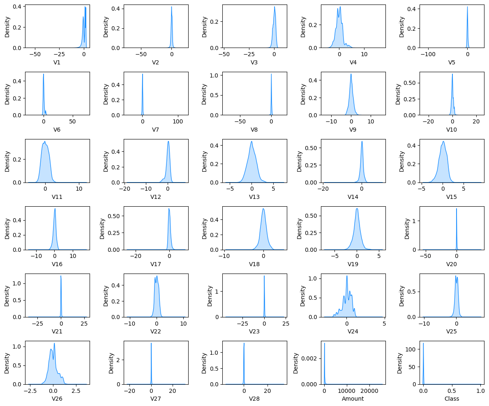

```python
import numpy as np
import pandas as pd
import matplotlib.pyplot as plt
import seaborn as sns
sns.reset_defaults()
```

### **Import Data**

*The data consist of 30 feature variables and 1 target variable with 284,806 instances*


```python
df = pd.read_pickle("data/df.pickle")
```


```python
df.tail()
```


<div>
<table border="1" class="dataframe">
  <thead>
    <tr style="text-align: right;">
      <th></th>
      <th>Time</th>
      <th>V1</th>
      <th>V2</th>
      <th>V3</th>
      <th>V4</th>
      <th>V5</th>
      <th>V6</th>
      <th>V7</th>
      <th>V8</th>
      <th>V9</th>
      <th>...</th>
      <th>V21</th>
      <th>V22</th>
      <th>V23</th>
      <th>V24</th>
      <th>V25</th>
      <th>V26</th>
      <th>V27</th>
      <th>V28</th>
      <th>Amount</th>
      <th>Class</th>
    </tr>
  </thead>
  <tbody>
    <tr>
      <th>284802</th>
      <td>172786.0</td>
      <td>-11.881118</td>
      <td>10.071785</td>
      <td>-9.834784</td>
      <td>-2.066656</td>
      <td>-5.364473</td>
      <td>-2.606837</td>
      <td>-4.918215</td>
      <td>7.305334</td>
      <td>1.914428</td>
      <td>...</td>
      <td>0.213454</td>
      <td>0.111864</td>
      <td>1.014480</td>
      <td>-0.509348</td>
      <td>1.436807</td>
      <td>0.250034</td>
      <td>0.943651</td>
      <td>0.823731</td>
      <td>0.770000</td>
      <td>0</td>
    </tr>
    <tr>
      <th>284803</th>
      <td>172787.0</td>
      <td>-0.732789</td>
      <td>-0.055080</td>
      <td>2.035030</td>
      <td>-0.738589</td>
      <td>0.868229</td>
      <td>1.058415</td>
      <td>0.024330</td>
      <td>0.294869</td>
      <td>0.584800</td>
      <td>...</td>
      <td>0.214205</td>
      <td>0.924384</td>
      <td>0.012463</td>
      <td>-1.016226</td>
      <td>-0.606624</td>
      <td>-0.395255</td>
      <td>0.068472</td>
      <td>-0.053527</td>
      <td>24.790001</td>
      <td>0</td>
    </tr>
    <tr>
      <th>284804</th>
      <td>172788.0</td>
      <td>1.919565</td>
      <td>-0.301254</td>
      <td>-3.249640</td>
      <td>-0.557828</td>
      <td>2.630515</td>
      <td>3.031260</td>
      <td>-0.296827</td>
      <td>0.708417</td>
      <td>0.432454</td>
      <td>...</td>
      <td>0.232045</td>
      <td>0.578229</td>
      <td>-0.037501</td>
      <td>0.640134</td>
      <td>0.265745</td>
      <td>-0.087371</td>
      <td>0.004455</td>
      <td>-0.026561</td>
      <td>67.879997</td>
      <td>0</td>
    </tr>
    <tr>
      <th>284805</th>
      <td>172788.0</td>
      <td>-0.240440</td>
      <td>0.530483</td>
      <td>0.702510</td>
      <td>0.689799</td>
      <td>-0.377961</td>
      <td>0.623708</td>
      <td>-0.686180</td>
      <td>0.679145</td>
      <td>0.392087</td>
      <td>...</td>
      <td>0.265245</td>
      <td>0.800049</td>
      <td>-0.163298</td>
      <td>0.123205</td>
      <td>-0.569159</td>
      <td>0.546668</td>
      <td>0.108821</td>
      <td>0.104533</td>
      <td>10.000000</td>
      <td>0</td>
    </tr>
    <tr>
      <th>284806</th>
      <td>172792.0</td>
      <td>-0.533413</td>
      <td>-0.189733</td>
      <td>0.703337</td>
      <td>-0.506271</td>
      <td>-0.012546</td>
      <td>-0.649617</td>
      <td>1.577006</td>
      <td>-0.414650</td>
      <td>0.486180</td>
      <td>...</td>
      <td>0.261057</td>
      <td>0.643078</td>
      <td>0.376777</td>
      <td>0.008797</td>
      <td>-0.473649</td>
      <td>-0.818267</td>
      <td>-0.002415</td>
      <td>0.013649</td>
      <td>217.000000</td>
      <td>0</td>
    </tr>
  </tbody>
</table>
<p>5 rows × 31 columns</p>
</div>


### **Target Class** 

*The data is highly imbalanced with `99.827%` of `class 0` and `0.172%` of `class 1`. There are very few instances of class 0 which makes classification difficult. This makes the data highly skewed towards majority class*


```python
print("Proportion of Target Class")
print(df["Class"].value_counts()/len(df)*100)
```

    Proportion of Target Class
    0    99.827251
    1     0.172749
    Name: Class, dtype: float64


```python
sns.barplot(x=df["Class"].value_counts()/len(df), y=df["Class"].unique(), orient="h", color="hotpink");
```


### **Statistical Summary**

*Most of the maximum and minimum values are outside of two standard deviation away from the attributes*   


```python
df.describe().T
```


<div>
<table border="1" class="dataframe">
  <thead>
    <tr style="text-align: right;">
      <th></th>
      <th>count</th>
      <th>mean</th>
      <th>std</th>
      <th>min</th>
      <th>25%</th>
      <th>50%</th>
      <th>75%</th>
      <th>max</th>
    </tr>
  </thead>
  <tbody>
    <tr>
      <th>Time</th>
      <td>284807.0</td>
      <td>9.481387e+04</td>
      <td>47488.144531</td>
      <td>0.000000</td>
      <td>54201.500000</td>
      <td>84692.000000</td>
      <td>139320.500000</td>
      <td>172792.000000</td>
    </tr>
    <tr>
      <th>V1</th>
      <td>284807.0</td>
      <td>1.339397e-08</td>
      <td>1.958696</td>
      <td>-56.407509</td>
      <td>-0.920373</td>
      <td>0.018109</td>
      <td>1.315642</td>
      <td>2.454930</td>
    </tr>
    <tr>
      <th>V2</th>
      <td>284807.0</td>
      <td>0.000000e+00</td>
      <td>1.651309</td>
      <td>-72.715729</td>
      <td>-0.598550</td>
      <td>0.065486</td>
      <td>0.803724</td>
      <td>22.057730</td>
    </tr>
    <tr>
      <th>V3</th>
      <td>284807.0</td>
      <td>-4.800400e-08</td>
      <td>1.516255</td>
      <td>-48.325588</td>
      <td>-0.890365</td>
      <td>0.179846</td>
      <td>1.027196</td>
      <td>9.382559</td>
    </tr>
    <tr>
      <th>V4</th>
      <td>284807.0</td>
      <td>6.643411e-09</td>
      <td>1.415869</td>
      <td>-5.683171</td>
      <td>-0.848640</td>
      <td>-0.019847</td>
      <td>0.743341</td>
      <td>16.875343</td>
    </tr>
    <tr>
      <th>V5</th>
      <td>284807.0</td>
      <td>2.657364e-08</td>
      <td>1.380247</td>
      <td>-113.743309</td>
      <td>-0.691597</td>
      <td>-0.054336</td>
      <td>0.611926</td>
      <td>34.801666</td>
    </tr>
    <tr>
      <th>V6</th>
      <td>284807.0</td>
      <td>-1.500125e-09</td>
      <td>1.332271</td>
      <td>-26.160505</td>
      <td>-0.768296</td>
      <td>-0.274187</td>
      <td>0.398565</td>
      <td>73.301628</td>
    </tr>
    <tr>
      <th>V7</th>
      <td>284807.0</td>
      <td>-1.071518e-09</td>
      <td>1.237094</td>
      <td>-43.557243</td>
      <td>-0.554076</td>
      <td>0.040103</td>
      <td>0.570436</td>
      <td>120.589493</td>
    </tr>
    <tr>
      <th>V8</th>
      <td>284807.0</td>
      <td>-1.071518e-10</td>
      <td>1.194353</td>
      <td>-73.216721</td>
      <td>-0.208630</td>
      <td>0.022358</td>
      <td>0.327346</td>
      <td>20.007208</td>
    </tr>
    <tr>
      <th>V9</th>
      <td>284807.0</td>
      <td>-3.214554e-10</td>
      <td>1.098632</td>
      <td>-13.434067</td>
      <td>-0.643098</td>
      <td>-0.051429</td>
      <td>0.597139</td>
      <td>15.594995</td>
    </tr>
    <tr>
      <th>V10</th>
      <td>284807.0</td>
      <td>-4.071768e-09</td>
      <td>1.088850</td>
      <td>-24.588263</td>
      <td>-0.535426</td>
      <td>-0.092917</td>
      <td>0.453923</td>
      <td>23.745136</td>
    </tr>
    <tr>
      <th>V11</th>
      <td>284807.0</td>
      <td>7.714928e-09</td>
      <td>1.020713</td>
      <td>-4.797473</td>
      <td>-0.762494</td>
      <td>-0.032757</td>
      <td>0.739593</td>
      <td>12.018913</td>
    </tr>
    <tr>
      <th>V12</th>
      <td>284807.0</td>
      <td>8.572143e-09</td>
      <td>0.999201</td>
      <td>-18.683714</td>
      <td>-0.405571</td>
      <td>0.140033</td>
      <td>0.618238</td>
      <td>7.848392</td>
    </tr>
    <tr>
      <th>V13</th>
      <td>284807.0</td>
      <td>1.580489e-09</td>
      <td>0.995274</td>
      <td>-5.791881</td>
      <td>-0.648539</td>
      <td>-0.013568</td>
      <td>0.662505</td>
      <td>7.126883</td>
    </tr>
    <tr>
      <th>V14</th>
      <td>284807.0</td>
      <td>-3.107402e-09</td>
      <td>0.958596</td>
      <td>-19.214325</td>
      <td>-0.425574</td>
      <td>0.050601</td>
      <td>0.493150</td>
      <td>10.526766</td>
    </tr>
    <tr>
      <th>V15</th>
      <td>284807.0</td>
      <td>-1.285821e-08</td>
      <td>0.915316</td>
      <td>-4.498945</td>
      <td>-0.582884</td>
      <td>0.048072</td>
      <td>0.648821</td>
      <td>8.877742</td>
    </tr>
    <tr>
      <th>V16</th>
      <td>284807.0</td>
      <td>7.500625e-10</td>
      <td>0.876253</td>
      <td>-14.129854</td>
      <td>-0.468037</td>
      <td>0.066413</td>
      <td>0.523296</td>
      <td>17.315111</td>
    </tr>
    <tr>
      <th>V17</th>
      <td>284807.0</td>
      <td>-2.625219e-09</td>
      <td>0.849337</td>
      <td>-25.162800</td>
      <td>-0.483748</td>
      <td>-0.065676</td>
      <td>0.399675</td>
      <td>9.253527</td>
    </tr>
    <tr>
      <th>V18</th>
      <td>284807.0</td>
      <td>2.357339e-09</td>
      <td>0.838176</td>
      <td>-9.498746</td>
      <td>-0.498850</td>
      <td>-0.003636</td>
      <td>0.500807</td>
      <td>5.041069</td>
    </tr>
    <tr>
      <th>V19</th>
      <td>284807.0</td>
      <td>2.678795e-10</td>
      <td>0.814040</td>
      <td>-7.213527</td>
      <td>-0.456299</td>
      <td>0.003735</td>
      <td>0.458949</td>
      <td>5.591971</td>
    </tr>
    <tr>
      <th>V20</th>
      <td>284807.0</td>
      <td>-1.178670e-09</td>
      <td>0.770925</td>
      <td>-54.497719</td>
      <td>-0.211721</td>
      <td>-0.062481</td>
      <td>0.133041</td>
      <td>39.420906</td>
    </tr>
    <tr>
      <th>V21</th>
      <td>284807.0</td>
      <td>-1.928732e-09</td>
      <td>0.734524</td>
      <td>-34.830383</td>
      <td>-0.228395</td>
      <td>-0.029450</td>
      <td>0.186377</td>
      <td>27.202839</td>
    </tr>
    <tr>
      <th>V22</th>
      <td>284807.0</td>
      <td>3.643161e-09</td>
      <td>0.725702</td>
      <td>-10.933144</td>
      <td>-0.542350</td>
      <td>0.006782</td>
      <td>0.528554</td>
      <td>10.503090</td>
    </tr>
    <tr>
      <th>V23</th>
      <td>284807.0</td>
      <td>3.214554e-10</td>
      <td>0.624460</td>
      <td>-44.807735</td>
      <td>-0.161846</td>
      <td>-0.011193</td>
      <td>0.147642</td>
      <td>22.528412</td>
    </tr>
    <tr>
      <th>V24</th>
      <td>284807.0</td>
      <td>1.259033e-09</td>
      <td>0.605647</td>
      <td>-2.836627</td>
      <td>-0.354586</td>
      <td>0.040976</td>
      <td>0.439527</td>
      <td>4.584549</td>
    </tr>
    <tr>
      <th>V25</th>
      <td>284807.0</td>
      <td>2.143036e-09</td>
      <td>0.521278</td>
      <td>-10.295397</td>
      <td>-0.317145</td>
      <td>0.016594</td>
      <td>0.350716</td>
      <td>7.519588</td>
    </tr>
    <tr>
      <th>V26</th>
      <td>284807.0</td>
      <td>1.034684e-09</td>
      <td>0.482227</td>
      <td>-2.604551</td>
      <td>-0.326984</td>
      <td>-0.052139</td>
      <td>0.240952</td>
      <td>3.517346</td>
    </tr>
    <tr>
      <th>V27</th>
      <td>284807.0</td>
      <td>1.138488e-10</td>
      <td>0.403632</td>
      <td>-22.565680</td>
      <td>-0.070840</td>
      <td>0.001342</td>
      <td>0.091045</td>
      <td>31.612198</td>
    </tr>
    <tr>
      <th>V28</th>
      <td>284807.0</td>
      <td>-1.272427e-10</td>
      <td>0.330083</td>
      <td>-15.430084</td>
      <td>-0.052960</td>
      <td>0.011244</td>
      <td>0.078280</td>
      <td>33.847809</td>
    </tr>
    <tr>
      <th>Amount</th>
      <td>284807.0</td>
      <td>8.834961e+01</td>
      <td>250.120117</td>
      <td>0.000000</td>
      <td>5.600000</td>
      <td>22.000000</td>
      <td>77.165001</td>
      <td>25691.160156</td>
    </tr>
    <tr>
      <th>Class</th>
      <td>284807.0</td>
      <td>1.727486e-03</td>
      <td>0.041527</td>
      <td>0.000000</td>
      <td>0.000000</td>
      <td>0.000000</td>
      <td>0.000000</td>
      <td>1.000000</td>
    </tr>
  </tbody>
</table>
</div>


### **Distributions of features**

*For the figure given below we can observe that most of the variables are `highly leptokurtic` in nature with
most of the values concentrated within a small interval around mean*


```python
fig, axes = plt.subplots(6, 5, figsize=(12,10))
col = df.columns[1:]
x = 0
for r in range(6):
    for c in range(5):
        sns.kdeplot(ax=axes[r,c],x=df[col[x]], y=None,fill=True, color="dodgerblue")
        x = x + 1
plt.tight_layout()
```





### **Boxplots**

*From the boxplot (**fig:Attributes with outliers**) we can observe there are a large number of outliers
within attributes with some instances located far away from interquartile range*

*From the boxplot (**fig:Boxplot without outliers**) we can observe all attributes have a mean value 
approximately equal to zero but with a varying degree of standard deviation.* 


```python
# boxplots
fig, ax = plt.subplots(1,2,figsize=(18,8))
sns.boxplot(data=df.iloc[:,1:-2], orient="h", color="deeppink",ax=ax[0])
ax[0].set_title("Attributes with outliers")
sns.boxplot(data=df.iloc[:,1:-2], orient="h", color="deeppink",showfliers=False, ax=ax[1])
ax[1].set_title("Boxplot without outliers");
```


### **Boxplot by target class** 

*Attributes `V11, V12, V14, V16, V17, V18` have unusually odd behaviour for class 1 in comparison to class 0. 
Other variables show similar behaviour for class 0 and 1.* 


```python
fig, axes = plt.subplots(5, 6, figsize=(15,15))
col = df.columns[1:]
x = 0
for r in range(5):
    for c in range(6):
        sns.boxplot(ax = axes[r,c],data=df, x="Class", y=col[x], palette="cool",)
        x = x + 1
plt.tight_layout()
```


### **Correlation among Variables**

*There seems no assosiation or relationship between V1-V29 but they are assosiated with `Amount` with varying 
degree. Variables `V1, V2, V3, V5, V6, V7, V20, V21` show a relatively strong assosiation with Amount in 
comparison to other variables.*  


```python
# heatmap
corr = np.round(df.iloc[:, 1:-1].corr(), 2)
plt.figure(figsize=(15,15))
sns.heatmap(corr , cmap="YlGnBu", linewidths=0.9, cbar=False, annot=True);
```


### **Baseline Model**

*We implement `decision tree` as our `baseline model` to compare performance with other models*


```python
train = pd.read_pickle("data/train.pickle")
test = pd.read_pickle("data/test.pickle")
```


```python
from sklearn.tree import DecisionTreeClassifier
from sklearn.metrics import classification_report, confusion_matrix
dtc = DecisionTreeClassifier()
dtc.fit(train.iloc[:,:-1], train["Class"])
pred = dtc.predict(test.iloc[:,:-1])
print(classification_report(pred, test["Class"]))
```

                  precision    recall  f1-score   support
    
               0       1.00      1.00      1.00     71080
               1       0.72      0.73      0.73       122
    
        accuracy                           1.00     71202
       macro avg       0.86      0.86      0.86     71202
    weighted avg       1.00      1.00      1.00     71202
    


```python
cm = confusion_matrix(pred, test["Class"])
ax = sns.heatmap(cm, cmap = "Purples", linewidths=0.9, cbar=False, annot=True, fmt="d")
ax.set(xlabel="Predicted", ylabel="Truth")
ax.set_title("Decision Tree")
```


    Text(0.5, 1.0, 'Decision Tree')


```python

```
