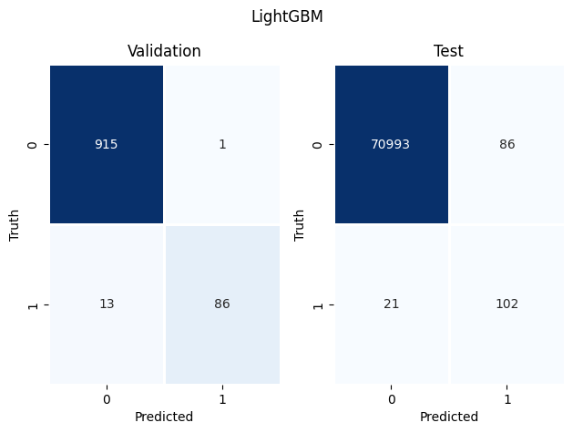
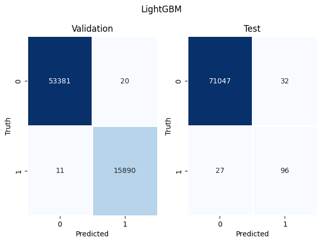

```python
import numpy as np
import pandas as pd
import matplotlib.pyplot as plt
import seaborn as sns
sns.reset_defaults()
```

### **Import Training and Testing set**

*We will use SMOTE balanced dataset for the purpose of tunning the hyperparameters* 


```python
train_smote = pd.read_pickle("data/train_smote.pickle")
test = pd.read_pickle("data/test.pickle")
```

### **Split Attributes and Target Class**


```python
x = train_smote.iloc[:, :-1]
y = train_smote["Class"]
```

### **Split training and validation set**


```python
from sklearn.model_selection import train_test_split
xtrain, xvalid, ytrain, yvalid = train_test_split(x, y, test_size=0.25, stratify=y,random_state=123)
```

### **LightGBM**

*It stands for `Light Gradient Boosting machine`. It gives faster training , low memory usage in comparison to other frameworks. 
LightGBM use leaf wise tree growth rather than level wise growth.*


```python
import lightgbm
from lightgbm import LGBMClassifier
from sklearn.metrics import roc_auc_score
```

### **Tunning Hyperparameter**

*Following hyperparameters are needed to be tuned using optuna.*
1. max_depth
2. subsample
3. learning_rate


```python
def optimize(trial):
    params = {
        "objective": "binary",
        "metric": "auc",
        "max_depth": trial.suggest_int("max_depth", 3, 50),
        "subsample":trial.suggest_float("subsample", 0.5, 1.0),
        "learning_rate": trial.suggest_float("learning_rate", 0.01, 1.0),
        "num_threads": -1,
        "verbosity":-1      # to remove unnecessary warnings 
    }
    lgbm_train = lightgbm.Dataset(xtrain.to_numpy(), ytrain.to_numpy())
    model_lgbm = lightgbm.train(params, lgbm_train)
    pred_prob = model_lgbm.predict(xvalid.to_numpy())
    v_pred = []
    for prob in pred_prob:
        if prob >=0.5:
            v_pred.append(1)
        else:
            v_pred.append(0)
    v_pred = np.array(v_pred)
    auc = roc_auc_score(yvalid.to_numpy(), v_pred)
    return auc
```


```python
import optuna
study = optuna.create_study(direction="maximize")
study.optimize(optimize,n_trials=30)
```

    [I 2022-08-21 18:22:28,042] A new study created in memory with name: no-name-6a7f62e4-b9ca-4861-aa4d-51930b3925b2
    [I 2022-08-21 18:22:29,619] Trial 0 finished with value: 0.9997092458605876 and parameters: {'max_depth': 31, 'subsample': 0.842105938525934, 'learning_rate': 0.10997923364939254}. Best is trial 0 with value: 0.9997092458605876.
    [I 2022-08-21 18:22:31,012] Trial 1 finished with value: 0.9959825936434182 and parameters: {'max_depth': 36, 'subsample': 0.7258201150180046, 'learning_rate': 0.3581766157448885}. Best is trial 0 with value: 0.9997092458605876.
    [I 2022-08-21 18:22:32,355] Trial 2 finished with value: 0.9956199240720687 and parameters: {'max_depth': 7, 'subsample': 0.8149059977690132, 'learning_rate': 0.34818863664501826}. Best is trial 0 with value: 0.9997092458605876.
    [I 2022-08-21 18:22:33,577] Trial 3 finished with value: 0.9956449448669097 and parameters: {'max_depth': 47, 'subsample': 0.8158740326787493, 'learning_rate': 0.384666772763067}. Best is trial 0 with value: 0.9997092458605876.
    [I 2022-08-21 18:22:35,180] Trial 4 finished with value: 0.9997530146577135 and parameters: {'max_depth': 15, 'subsample': 0.699360287805733, 'learning_rate': 0.114923067444037}. Best is trial 4 with value: 0.9997530146577135.
    [I 2022-08-21 18:22:36,421] Trial 5 finished with value: 0.9923309703824645 and parameters: {'max_depth': 6, 'subsample': 0.8373064701149243, 'learning_rate': 0.7335829247046131}. Best is trial 4 with value: 0.9997530146577135.
    [I 2022-08-21 18:22:37,643] Trial 6 finished with value: 0.9929593803359239 and parameters: {'max_depth': 38, 'subsample': 0.688165681650755, 'learning_rate': 0.6576361264205345}. Best is trial 4 with value: 0.9997530146577135.
    [I 2022-08-21 18:22:38,851] Trial 7 finished with value: 0.9954886124025375 and parameters: {'max_depth': 12, 'subsample': 0.6921062923500734, 'learning_rate': 0.47715085663684775}. Best is trial 4 with value: 0.9997530146577135.
    [I 2022-08-21 18:22:40,136] Trial 8 finished with value: 0.9897235747227418 and parameters: {'max_depth': 42, 'subsample': 0.9263461385701255, 'learning_rate': 0.9227160096423876}. Best is trial 4 with value: 0.9997530146577135.
    [I 2022-08-21 18:22:41,255] Trial 9 finished with value: 0.9873506610454236 and parameters: {'max_depth': 6, 'subsample': 0.9910691603083432, 'learning_rate': 0.9981491908861296}. Best is trial 4 with value: 0.9997530146577135.
    [I 2022-08-21 18:22:42,692] Trial 10 finished with value: 0.9900487553270603 and parameters: {'max_depth': 21, 'subsample': 0.5394560612731616, 'learning_rate': 0.027558053552088735}. Best is trial 4 with value: 0.9997530146577135.
    [I 2022-08-21 18:22:43,996] Trial 11 finished with value: 0.9929594067266929 and parameters: {'max_depth': 25, 'subsample': 0.6170454189381113, 'learning_rate': 0.03567958956950136}. Best is trial 4 with value: 0.9997530146577135.
    [I 2022-08-21 18:22:45,683] Trial 12 finished with value: 0.9996029479483591 and parameters: {'max_depth': 17, 'subsample': 0.8813981122157091, 'learning_rate': 0.1926140709795045}. Best is trial 4 with value: 0.9997530146577135.
    [I 2022-08-21 18:22:47,086] Trial 13 finished with value: 0.9966235122349135 and parameters: {'max_depth': 32, 'subsample': 0.6185010193292977, 'learning_rate': 0.19331270295225556}. Best is trial 4 with value: 0.9997530146577135.
    [I 2022-08-21 18:22:48,683] Trial 14 finished with value: 0.9965078350433889 and parameters: {'max_depth': 29, 'subsample': 0.7660936232271005, 'learning_rate': 0.18775808770012087}. Best is trial 4 with value: 0.9997530146577135.
    [I 2022-08-21 18:22:50,616] Trial 15 finished with value: 0.999787404175543 and parameters: {'max_depth': 18, 'subsample': 0.6238325677621209, 'learning_rate': 0.13156675109140303}. Best is trial 15 with value: 0.999787404175543.
    [I 2022-08-21 18:22:52,407] Trial 16 finished with value: 0.9893484246635098 and parameters: {'max_depth': 16, 'subsample': 0.5397892186259456, 'learning_rate': 0.27343304163349125}. Best is trial 15 with value: 0.999787404175543.
    [I 2022-08-21 18:22:53,930] Trial 17 finished with value: 0.9946757638157403 and parameters: {'max_depth': 23, 'subsample': 0.6190983305451907, 'learning_rate': 0.5265870840384661}. Best is trial 15 with value: 0.999787404175543.
    [I 2022-08-21 18:22:55,919] Trial 18 finished with value: 0.9997717732163058 and parameters: {'max_depth': 13, 'subsample': 0.6575292066360062, 'learning_rate': 0.11862865047460029}. Best is trial 15 with value: 0.999787404175543.
    [I 2022-08-21 18:22:57,461] Trial 19 finished with value: 0.9913711826856682 and parameters: {'max_depth': 10, 'subsample': 0.5888983636365714, 'learning_rate': 0.532964640925186}. Best is trial 15 with value: 0.999787404175543.
    [I 2022-08-21 18:22:58,642] Trial 20 finished with value: 0.9967016723092534 and parameters: {'max_depth': 3, 'subsample': 0.6513152204371156, 'learning_rate': 0.23909589807620363}. Best is trial 15 with value: 0.999787404175543.
    [I 2022-08-21 18:23:00,435] Trial 21 finished with value: 0.9996373374661888 and parameters: {'max_depth': 17, 'subsample': 0.753099205188683, 'learning_rate': 0.10551292257487421}. Best is trial 15 with value: 0.999787404175543.
    [I 2022-08-21 18:23:02,234] Trial 22 finished with value: 0.9997530146577135 and parameters: {'max_depth': 14, 'subsample': 0.6696924578001535, 'learning_rate': 0.10282363048375341}. Best is trial 15 with value: 0.999787404175543.
    [I 2022-08-21 18:23:03,756] Trial 23 finished with value: 0.9837991455952182 and parameters: {'max_depth': 20, 'subsample': 0.574658876152899, 'learning_rate': 0.016542634735439377}. Best is trial 15 with value: 0.999787404175543.
    [I 2022-08-21 18:23:05,640] Trial 24 finished with value: 0.9955730364725106 and parameters: {'max_depth': 11, 'subsample': 0.736657005077057, 'learning_rate': 0.27913631254113147}. Best is trial 15 with value: 0.999787404175543.
    [I 2022-08-21 18:23:07,455] Trial 25 finished with value: 0.9997248768198248 and parameters: {'max_depth': 12, 'subsample': 0.5027161013814246, 'learning_rate': 0.1287410489076087}. Best is trial 15 with value: 0.999787404175543.
    [I 2022-08-21 18:23:09,310] Trial 26 finished with value: 0.9995404188332564 and parameters: {'max_depth': 20, 'subsample': 0.658704114876506, 'learning_rate': 0.3028428652830563}. Best is trial 15 with value: 0.999787404175543.
    [I 2022-08-21 18:23:10,848] Trial 27 finished with value: 0.9950821898685235 and parameters: {'max_depth': 26, 'subsample': 0.6744578829119793, 'learning_rate': 0.4531570846259815}. Best is trial 15 with value: 0.999787404175543.
    [I 2022-08-21 18:23:12,591] Trial 28 finished with value: 0.9995748101104707 and parameters: {'max_depth': 14, 'subsample': 0.6392051933634203, 'learning_rate': 0.08052407409246737}. Best is trial 15 with value: 0.999787404175543.
    [I 2022-08-21 18:23:14,351] Trial 29 finished with value: 0.999734256099121 and parameters: {'max_depth': 8, 'subsample': 0.5781312396489469, 'learning_rate': 0.15949546738294737}. Best is trial 15 with value: 0.999787404175543.


### **Fitting model**

*We implement function that fits the data with specific hyperparameters to the LightGBM model and then 
prints the precision recall for target classes in test set with the confusion matrix of validation and 
test set*


```python
from sklearn.metrics import classification_report, confusion_matrix
```


```python
def lgbm_fit(train_set):
    xtrain, xvalid, ytrain, yvalid = train_test_split(train_set.iloc[:,:-1].to_numpy(), 
                                                      train_set["Class"].to_numpy(), test_size=0.25, random_state=123)
    lgb = LGBMClassifier(objective="binary",
                        metric="auc",
                        max_depth=15, 
                        subsample=0.5, 
                        learning_rate=0.1, 
                        verbosity = -1)
    lgb.fit(xtrain, ytrain)
    v_pred = lgb.predict(xvalid)
    y_pred = lgb.predict(test.iloc[:,:-1])
    vcm = confusion_matrix(yvalid,v_pred)
    ycm = confusion_matrix(test["Class"], y_pred)
    fig , axes = plt.subplots(1,2)
    fig1 = sns.heatmap(vcm, cmap="Blues", linewidths=0.9, cbar=False, annot=True, fmt ="d",ax=axes[0])
    fig2 = sns.heatmap(ycm, cmap="Blues", linewidths=0.9, cbar=False, annot=True, fmt ="d",ax=axes[1])
    fig1.set(xlabel="Predicted", ylabel="Truth")
    fig1.set_title("Validation")
    fig2.set(xlabel="Predicted", ylabel="Truth")
    fig2.set_title("Test")
    fig.suptitle("LightGBM")
    plt.tight_layout()
```

### **Undersampling**


```python
train_under = pd.read_pickle("data/train_under.pickle")
lgbm_fit(train_under)
```





### **Bootstrap Sampling**


```python
train_over = pd.read_pickle("data/train_over.pickle")
lgbm_fit(train_over)
```


### **Oversampling with shrinkage**


```python
train_over_shrink = pd.read_pickle("data/train_over_shrink.pickle")
lgbm_fit(train_over_shrink)
```


### **SMOTE**


```python
lgbm_fit(train_smote)
```





### **ADASYN**


```python
train_adasyn = pd.read_pickle("data/train_adasyn.pickle")
lgbm_fit(train_adasyn)
```


### **Save Model**


```python
xtrain = train_over_shrink.iloc[:, :-1].to_numpy()
ytrain = train_over_shrink["Class"].to_numpy()

lgb = LGBMClassifier(objective="binary",
                        metric="auc",
                        max_depth=14, 
                        subsample=0.5, 
                        learning_rate=0.1, 
                        verbosity = -1)
lgb.fit(xtrain, ytrain)
```


```python
import joblib
joblib.dump(lgb, "models/lgb.pkl")
```

    ['models/lgb.pkl']


```python

```
