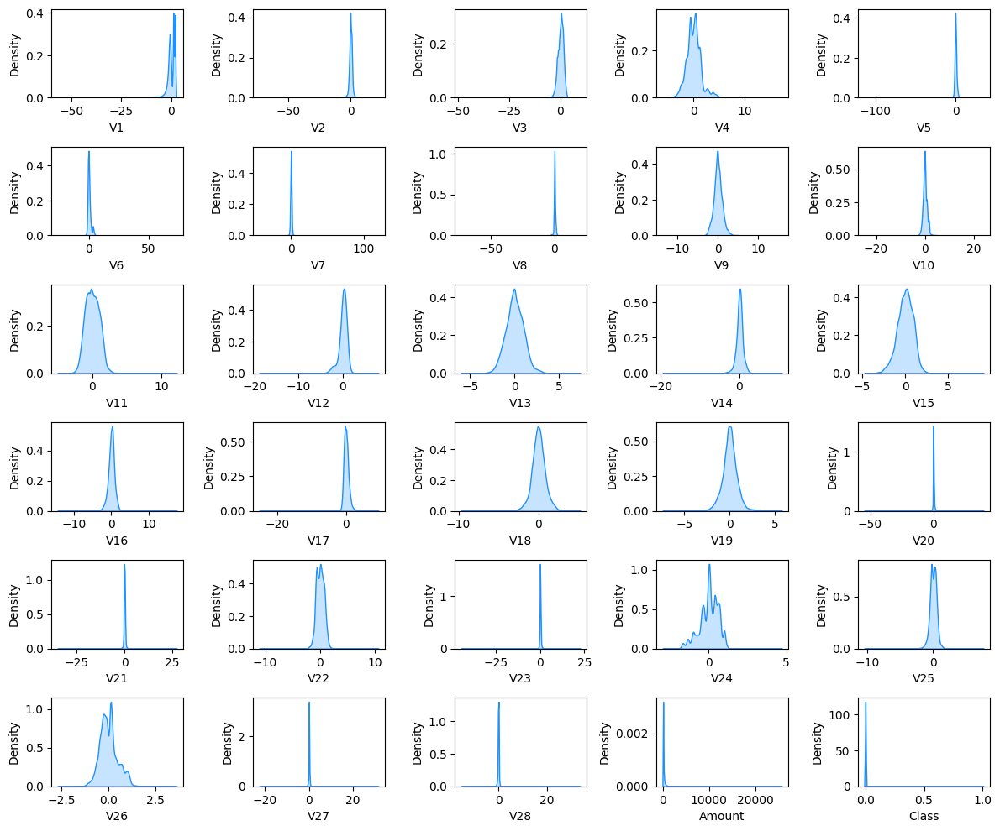
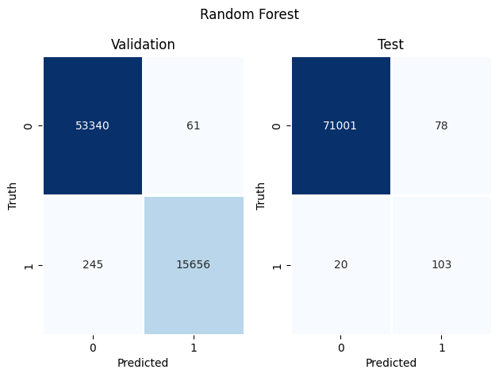
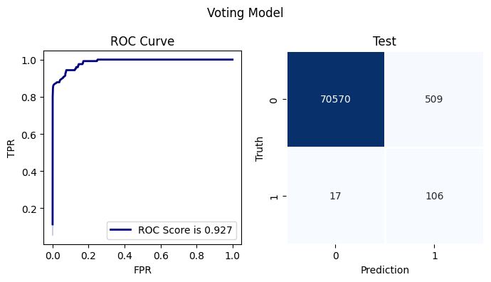
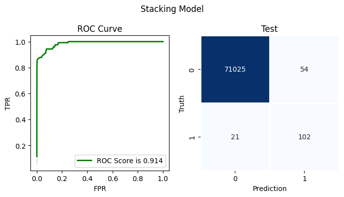

# **Transaction Fraud Detection**

### **About**

*The project consists of a highly `imbalanced` target class. Our goal is to recognize `fraudulent` credit card `transactions` so that customers are not charged for purchases they did not make. We deploy ensemble methods and boosting algorithms like `Random Forest`, `Xgboost`, and `LightGBM`. We further try to improve our prediction using a `Voting classifier` and `stacking` techniques to get a better AUC score.*

### **Data**
*The data consist of 30 feature variables and 1 target variable with 284,806 instances, provided by Machine Learning Group on [Kaggle](https://www.kaggle.com/datasets/mlg-ulb/creditcardfraud)*

### **Project Link** 

*Our analysis include following topics (for detailed analysis click the link)*

||page_link|notebook|
|---|---|---|
|**Data Processing**|[*main*](https://github.com/nabeel-io/customer_transaction_prediction/tree/main/DataProcessing)|[*notebook*](DataProcessing/DataProcessing.ipynb)|
|**Exploratory Data Analysis**|[*main*](https://github.com/nabeel-io/customer_transaction_prediction/tree/main/EDA)|[*notebook*](EDA/EDA.ipynb)|
|**Balanced Data**|[*main*](https://github.com/nabeel-io/customer_transaction_prediction/tree/main/BalancedData)|[*notebook*](BalancedData/BalancedData.ipynb)|
|**Random Forest Classifier**|[*main*](https://github.com/nabeel-io/customer_transaction_prediction/tree/main/RandomForest)|[*notebook*](RandomForest/RandomForest.ipynb)|
|**Xgboost**|[*main*](https://github.com/nabeel-io/customer_transaction_prediction/tree/main/Xgboost)|[*notebook*](Xgboost/Xgboost.ipynb)|
|**LightGBM**|[*main*](https://github.com/nabeel-io/customer_transaction_prediction/tree/main/LightGBM)|[*notebook*](LightGBM/LightGBM.ipynb)|
|**Stacking_Voting**|[*main*](https://github.com/nabeel-io/customer_transaction_prediction/tree/main/Stacking_Voting)|[*notebook*](Stacking_Voting/Stacking_Blending.ipynb)|

### **Feature Distribution**

### **Results**

