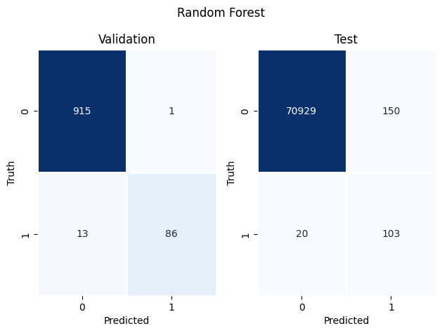
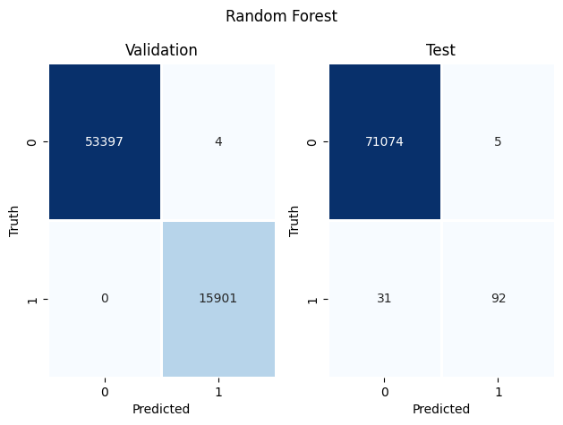

### **Import libraries**


```python
import numpy as np
import pandas as pd
import matplotlib.pyplot as plt
import seaborn as sns
sns.reset_defaults()
```

### **Import Training and Testing set**

*We will use SMOTE balanced dataset for the purpose of tunning the hyperparameters* 


```python
train_smote = pd.read_pickle("data/train_smote.pickle")
test = pd.read_pickle("data/test.pickle")
```

### **Split Attributes and Target Class**


```python
x = train_smote.iloc[:, :-1]
y = train_smote["Class"]
```

### **Split training and validation set**


```python
from sklearn.model_selection import train_test_split
xtrain, xvalid, ytrain, yvalid = train_test_split(x, y, test_size=0.25, stratify=y,random_state=123)
```

### **Random Forest**

*We will use Random Forest Classifier to train our model. Random Forest is an ensemble technique which uses a number of weak
classifiers and implement a majority vote to classify the sample into target class*


```python
from sklearn.ensemble import RandomForestClassifier
from sklearn.metrics import roc_auc_score
```


```python
def objective(trial):
    n_estimators = trial.suggest_int("n_estimators", 100, 300)
    min_samples_split = trial.suggest_int("min_samples_split", 10, 100)
    max_features = trial.suggest_float("max_features", 0.5, 1.0)
    n_jobs = -1
    rfc = RandomForestClassifier(n_estimators=n_estimators, min_samples_split=min_samples_split,
                                 max_features=max_features, n_jobs=n_jobs)
    rfc.fit(xtrain, ytrain)
    ypred = rfc.predict(xvalid)
    auc = roc_auc_score(yvalid, ypred)
    return auc
```

### **Tunning Hyperparameter**

*Following hyperparameters are needed to be tuned using optuna.*
1. n_estimators
2. min_sample_split
3. max_features


```python
import optuna
study = optuna.create_study(direction="maximize")
study.optimize(objective,n_trials=20 )
```

    [I 2022-08-22 21:35:02,398] A new study created in memory with name: no-name-57827972-2fd7-476e-afac-84e330495725
    [I 2022-08-22 21:39:49,215] Trial 0 finished with value: 0.9990745930241102 and parameters: {'n_estimators': 195, 'min_samples_split': 12, 'max_features': 0.6268551087950731}. Best is trial 0 with value: 0.9990745930241102.
    [I 2022-08-22 21:45:54,550] Trial 1 finished with value: 0.9977365065561115 and parameters: {'n_estimators': 243, 'min_samples_split': 43, 'max_features': 0.6498908534037116}. Best is trial 0 with value: 0.9990745930241102.
    [I 2022-08-22 21:52:10,094] Trial 2 finished with value: 0.9988588731190673 and parameters: {'n_estimators': 178, 'min_samples_split': 19, 'max_features': 0.7937655652569484}. Best is trial 0 with value: 0.9990745930241102.
    [I 2022-08-22 21:55:54,062] Trial 3 finished with value: 0.9986087636961948 and parameters: {'n_estimators': 115, 'min_samples_split': 21, 'max_features': 0.7260951285823463}. Best is trial 0 with value: 0.9990745930241102.
    [I 2022-08-22 22:00:00,479] Trial 4 finished with value: 0.9982773683590117 and parameters: {'n_estimators': 111, 'min_samples_split': 24, 'max_features': 0.821508809608192}. Best is trial 0 with value: 0.9990745930241102.
    [I 2022-08-22 22:05:18,266] Trial 5 finished with value: 0.9968798821346502 and parameters: {'n_estimators': 193, 'min_samples_split': 51, 'max_features': 0.6934823027757608}. Best is trial 0 with value: 0.9990745930241102.
    [I 2022-08-22 22:12:18,592] Trial 6 finished with value: 0.9973832268203657 and parameters: {'n_estimators': 182, 'min_samples_split': 32, 'max_features': 0.9158183516934422}. Best is trial 0 with value: 0.9990745930241102.
    [I 2022-08-22 22:21:57,530] Trial 7 finished with value: 0.997208149872478 and parameters: {'n_estimators': 252, 'min_samples_split': 36, 'max_features': 0.9262847348100878}. Best is trial 0 with value: 0.9990745930241102.
    [I 2022-08-22 22:29:07,766] Trial 8 finished with value: 0.996429683765972 and parameters: {'n_estimators': 196, 'min_samples_split': 53, 'max_features': 0.8758154574838798}. Best is trial 0 with value: 0.9990745930241102.
    [I 2022-08-22 22:33:06,630] Trial 9 finished with value: 0.9944788306194433 and parameters: {'n_estimators': 112, 'min_samples_split': 81, 'max_features': 0.8491371298458549}. Best is trial 0 with value: 0.9990745930241102.
    [I 2022-08-22 22:38:52,271] Trial 10 finished with value: 0.9956355884596133 and parameters: {'n_estimators': 289, 'min_samples_split': 76, 'max_features': 0.5156774098583745}. Best is trial 0 with value: 0.9990745930241102.
    [I 2022-08-22 22:42:28,891] Trial 11 finished with value: 0.9990933515827025 and parameters: {'n_estimators': 158, 'min_samples_split': 11, 'max_features': 0.5904525896268742}. Best is trial 11 with value: 0.9990933515827025.
    [I 2022-08-22 22:45:55,675] Trial 12 finished with value: 0.999227785573435 and parameters: {'n_estimators': 152, 'min_samples_split': 11, 'max_features': 0.5737141749856183}. Best is trial 12 with value: 0.999227785573435.
    [I 2022-08-22 22:49:04,121] Trial 13 finished with value: 0.9992496699719978 and parameters: {'n_estimators': 153, 'min_samples_split': 10, 'max_features': 0.5066230809367975}. Best is trial 13 with value: 0.9992496699719978.
    [I 2022-08-22 22:52:02,848] Trial 14 finished with value: 0.9964609492032155 and parameters: {'n_estimators': 149, 'min_samples_split': 67, 'max_features': 0.5121731447640188}. Best is trial 13 with value: 0.9992496699719978.
    [I 2022-08-22 22:55:09,220] Trial 15 finished with value: 0.9940380132894459 and parameters: {'n_estimators': 144, 'min_samples_split': 99, 'max_features': 0.5657988681153598}. Best is trial 13 with value: 0.9992496699719978.
    [I 2022-08-22 23:00:05,063] Trial 16 finished with value: 0.9983461491540556 and parameters: {'n_estimators': 230, 'min_samples_split': 32, 'max_features': 0.5605277341023566}. Best is trial 13 with value: 0.9992496699719978.
    [I 2022-08-22 23:03:27,093] Trial 17 finished with value: 0.999196521895576 and parameters: {'n_estimators': 132, 'min_samples_split': 11, 'max_features': 0.6653522052932446}. Best is trial 13 with value: 0.9992496699719978.
    [I 2022-08-22 23:06:47,868] Trial 18 finished with value: 0.9977896563919181 and parameters: {'n_estimators': 167, 'min_samples_split': 43, 'max_features': 0.5080630749986391}. Best is trial 13 with value: 0.9992496699719978.
    [I 2022-08-22 23:13:54,604] Trial 19 finished with value: 0.9982773683590117 and parameters: {'n_estimators': 219, 'min_samples_split': 25, 'max_features': 0.7680737748053406}. Best is trial 13 with value: 0.9992496699719978.


### **Fitting model**

*We implement function that fits the data with specific hyperparameters to the Random Forest model and then 
prints the precision recall for target classes in test set with the confusion matrix of validation and 
test set*

### **RFC function** 


```python
from sklearn.metrics import classification_report, confusion_matrix

def rfc_fit(train_set, ):
    xtrain, xvalid, ytrain, yvalid = train_test_split(train_set.iloc[:,:-1], train_set["Class"], test_size=0.25, random_state=123)
    rfc = RandomForestClassifier(n_estimators=250, min_samples_split=10, max_features=0.65, n_jobs=-1)
    rfc.fit(xtrain, ytrain)
    v_pred = rfc.predict(xvalid)
    y_pred = rfc.predict(test.iloc[:,:-1])
    vcm = confusion_matrix(yvalid,v_pred)
    ycm = confusion_matrix(test["Class"], y_pred)
    fig , axes = plt.subplots(1,2)
    fig1 = sns.heatmap(vcm, cmap="Blues", linewidths=0.9, cbar=False, annot=True, fmt ="d",ax=axes[0])
    fig2 = sns.heatmap(ycm, cmap="Blues", linewidths=0.9, cbar=False, annot=True, fmt ="d",ax=axes[1])
    fig1.set(xlabel="Predicted", ylabel="Truth")
    fig1.set_title("Validation")
    fig2.set(xlabel="Predicted", ylabel="Truth")
    fig2.set_title("Test")
    fig.suptitle("Random Forest")
    plt.tight_layout()
    print(classification_report(test["Class"], y_pred))
```

### **Predictions on different synthetically balanced datasets**

### **Undersampling**


```python
train_under = pd.read_pickle("data/train_under.pickle")
rfc_fit(train_under)
```

                  precision    recall  f1-score   support
    
               0       1.00      1.00      1.00     71079
               1       0.41      0.84      0.55       123
    
        accuracy                           1.00     71202
       macro avg       0.70      0.92      0.77     71202
    weighted avg       1.00      1.00      1.00     71202
    





### **Bootstrap Sampling**


```python
train_over = pd.read_pickle("data/train_over.pickle")
rfc_fit(train_over)
```

                  precision    recall  f1-score   support
    
               0       1.00      1.00      1.00     71079
               1       0.95      0.75      0.84       123
    
        accuracy                           1.00     71202
       macro avg       0.97      0.87      0.92     71202
    weighted avg       1.00      1.00      1.00     71202
    





### **Oversampling with shrinkage**


```python
train_over_shrink = pd.read_pickle("data/train_over_shrink.pickle")
rfc_fit(train_over_shrink)
```

                  precision    recall  f1-score   support
    
               0       1.00      1.00      1.00     71079
               1       0.57      0.84      0.68       123
    
        accuracy                           1.00     71202
       macro avg       0.78      0.92      0.84     71202
    weighted avg       1.00      1.00      1.00     71202
    


### **SMOTE**


```python
rfc_fit(train_smote)
```

                  precision    recall  f1-score   support
    
               0       1.00      1.00      1.00     71079
               1       0.83      0.78      0.80       123
    
        accuracy                           1.00     71202
       macro avg       0.91      0.89      0.90     71202
    weighted avg       1.00      1.00      1.00     71202
    


### **ADASYN**


```python
train_adasyn = pd.read_pickle("data/train_adasyn.pickle")
rfc_fit(train_adasyn)
```

                  precision    recall  f1-score   support
    
               0       1.00      1.00      1.00     71079
               1       0.82      0.78      0.80       123
    
        accuracy                           1.00     71202
       macro avg       0.91      0.89      0.90     71202
    weighted avg       1.00      1.00      1.00     71202
    


### **Save Model**


```python
xtrain = train_over_shrink.iloc[:, :-1].to_numpy()
ytrain = train_over_shrink["Class"].to_numpy()
rfc = RandomForestClassifier(n_estimators=250, min_samples_split=10, max_features=0.65, n_jobs=-1)
rfc.fit(xtrain, ytrain)
```


```python
import joblib
joblib.dump(rfc, "models/rfc.pkl")
```


    ['models/rfc.pkl']


```python

```
