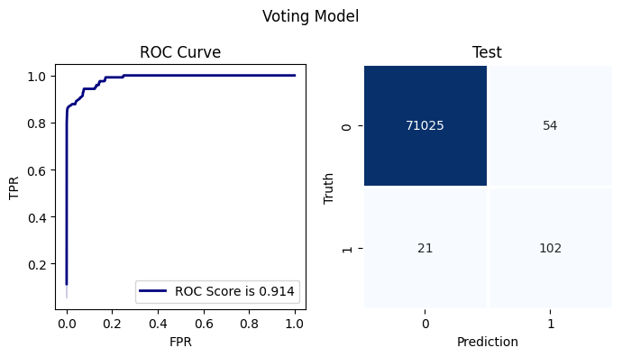
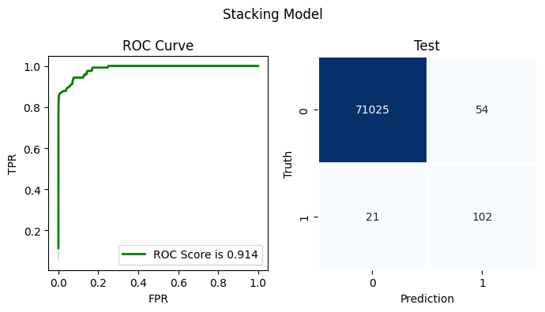

# **Voting and Stacking**

### **Importing libraries**


```python
# import library
import pandas as pd
import numpy as np
import matplotlib.pyplot as plt
import seaborn as sns
import joblib
sns.reset_defaults()
```


```python
from sklearn.metrics import confusion_matrix
from sklearn.metrics import classification_report
from sklearn.metrics import roc_auc_score, roc_curve
```

### **Testing and Training Data**


```python
# loading training and testing data
train = pd.read_pickle("data/train_over_shrink.pickle")
test = pd.read_pickle("data/test.pickle")
```

### **Loading Models**

*Reloading random forest, xgboost and lightgbm models using joblib*


```python
# loading models
rfc = joblib.load("models/rfc.pkl")
xgb = joblib.load("models/xgb.pkl")
lgb = joblib.load("models/lgb.pkl")
```

### **Calculating probabilities for training and testing set**


```python
def predict_probability(data):
    df = pd.DataFrame()
    df["rfc"] = rfc.predict_proba(data.to_numpy()).T[1]
    df["xgb"] = xgb.predict_proba(data.to_numpy()).T[1]
    df["lgb"] = lgb.predict_proba(data.to_numpy()).T[1]
    return df
```


```python
train_probability = predict_probability(train.iloc[:, :-1])
test_probability = predict_probability(test.iloc[:, :-1])
```

### **Voting Model**

*In Voting Classifier we calculate probabilities from several classifiers (RFC, Xgboost, LGBM) and we combine there predicted 
probabilities to get an average probability assosiated with the class*


```python
voting_prob = test_probability.sum(axis=1)
test_pred = []
for p in voting_prob:
    if p <= 0.5:
        test_pred.append(0)
    else:
        test_pred.append(1)
```


```python
test_actual = test["Class"].to_numpy()
```


```python
cm = confusion_matrix(test_actual, test_pred)
print(cm)
```

    [[70570   509]
     [   17   106]]


```python
score = np.round(roc_auc_score(test_actual, test_pred), 3)
print(score)
```

    0.927


```python
fpr, tpr, _ = roc_curve(test_actual, blended_prob)
fig, axes = plt.subplots(nrows=1, ncols=2, figsize=(7,4))
fig1 = sns.lineplot(x=fpr, y=tpr, color="navy", linewidth=2.0, ax=axes[0], label = f"ROC Score is {score}")
#sns.scatterplot(x=fpr[50:80], y=tpr[50:80], color="black", ax=axes[0])
fig2 = sns.heatmap(cm, cmap="Blues", linewidths=0.9, cbar=False, annot=True, fmt="d", ax=axes[1])
fig1.set(xlabel="FPR", ylabel="TPR")
fig1.set_title("ROC Curve")
fig2.set(xlabel="Prediction", ylabel="Truth")
fig2.set_title("Test")
fig.suptitle("Voting Model")
plt.tight_layout()
```





*Voting Classifier improve the model by increasing the recall for class 1 to 0.86%*


```python
print(classification_report(test_actual, test_pred))
```

                  precision    recall  f1-score   support
    
               0       1.00      0.99      1.00     71079
               1       0.17      0.86      0.29       123
    
        accuracy                           0.99     71202
       macro avg       0.59      0.93      0.64     71202
    weighted avg       1.00      0.99      1.00     71202
    


### **Stacking Model**
*In stacking we have two levels of implementing ML models, at level 0 we calculate the predictions from several classifiers from the 
data we use to train and feed these probabilities as new features to a level 1 classifier to get final predictions.*


```python
from sklearn.linear_model import LogisticRegression
# level 1 model
logit = LogisticRegression()
logit.fit(train_probability, train["Class"])
```


<style>#sk-container-id-7 {color: black;background-color: white;}#sk-container-id-7 pre{padding: 0;}#sk-container-id-7 div.sk-toggleable {background-color: white;}#sk-container-id-7 label.sk-toggleable__label {cursor: pointer;display: block;width: 100%;margin-bottom: 0;padding: 0.3em;box-sizing: border-box;text-align: center;}#sk-container-id-7 label.sk-toggleable__label-arrow:before {content: "▸";float: left;margin-right: 0.25em;color: #696969;}#sk-container-id-7 label.sk-toggleable__label-arrow:hover:before {color: black;}#sk-container-id-7 div.sk-estimator:hover label.sk-toggleable__label-arrow:before {color: black;}#sk-container-id-7 div.sk-toggleable__content {max-height: 0;max-width: 0;overflow: hidden;text-align: left;background-color: #f0f8ff;}#sk-container-id-7 div.sk-toggleable__content pre {margin: 0.2em;color: black;border-radius: 0.25em;background-color: #f0f8ff;}#sk-container-id-7 input.sk-toggleable__control:checked~div.sk-toggleable__content {max-height: 200px;max-width: 100%;overflow: auto;}#sk-container-id-7 input.sk-toggleable__control:checked~label.sk-toggleable__label-arrow:before {content: "▾";}#sk-container-id-7 div.sk-estimator input.sk-toggleable__control:checked~label.sk-toggleable__label {background-color: #d4ebff;}#sk-container-id-7 div.sk-label input.sk-toggleable__control:checked~label.sk-toggleable__label {background-color: #d4ebff;}#sk-container-id-7 input.sk-hidden--visually {border: 0;clip: rect(1px 1px 1px 1px);clip: rect(1px, 1px, 1px, 1px);height: 1px;margin: -1px;overflow: hidden;padding: 0;position: absolute;width: 1px;}#sk-container-id-7 div.sk-estimator {font-family: monospace;background-color: #f0f8ff;border: 1px dotted black;border-radius: 0.25em;box-sizing: border-box;margin-bottom: 0.5em;}#sk-container-id-7 div.sk-estimator:hover {background-color: #d4ebff;}#sk-container-id-7 div.sk-parallel-item::after {content: "";width: 100%;border-bottom: 1px solid gray;flex-grow: 1;}#sk-container-id-7 div.sk-label:hover label.sk-toggleable__label {background-color: #d4ebff;}#sk-container-id-7 div.sk-serial::before {content: "";position: absolute;border-left: 1px solid gray;box-sizing: border-box;top: 0;bottom: 0;left: 50%;z-index: 0;}#sk-container-id-7 div.sk-serial {display: flex;flex-direction: column;align-items: center;background-color: white;padding-right: 0.2em;padding-left: 0.2em;position: relative;}#sk-container-id-7 div.sk-item {position: relative;z-index: 1;}#sk-container-id-7 div.sk-parallel {display: flex;align-items: stretch;justify-content: center;background-color: white;position: relative;}#sk-container-id-7 div.sk-item::before, #sk-container-id-7 div.sk-parallel-item::before {content: "";position: absolute;border-left: 1px solid gray;box-sizing: border-box;top: 0;bottom: 0;left: 50%;z-index: -1;}#sk-container-id-7 div.sk-parallel-item {display: flex;flex-direction: column;z-index: 1;position: relative;background-color: white;}#sk-container-id-7 div.sk-parallel-item:first-child::after {align-self: flex-end;width: 50%;}#sk-container-id-7 div.sk-parallel-item:last-child::after {align-self: flex-start;width: 50%;}#sk-container-id-7 div.sk-parallel-item:only-child::after {width: 0;}#sk-container-id-7 div.sk-dashed-wrapped {border: 1px dashed gray;margin: 0 0.4em 0.5em 0.4em;box-sizing: border-box;padding-bottom: 0.4em;background-color: white;}#sk-container-id-7 div.sk-label label {font-family: monospace;font-weight: bold;display: inline-block;line-height: 1.2em;}#sk-container-id-7 div.sk-label-container {text-align: center;}#sk-container-id-7 div.sk-container {/* jupyter's `normalize.less` sets `[hidden] { display: none; }` but bootstrap.min.css set `[hidden] { display: none !important; }` so we also need the `!important` here to be able to override the default hidden behavior on the sphinx rendered scikit-learn.org. See: https://github.com/scikit-learn/scikit-learn/issues/21755 */display: inline-block !important;position: relative;}#sk-container-id-7 div.sk-text-repr-fallback {display: none;}</style><div id="sk-container-id-7" class="sk-top-container"><div class="sk-text-repr-fallback"><pre>LogisticRegression()</pre><b>In a Jupyter environment, please rerun this cell to show the HTML representation or trust the notebook. <br />On GitHub, the HTML representation is unable to render, please try loading this page with nbviewer.org.</b></div><div class="sk-container" hidden><div class="sk-item"><div class="sk-estimator sk-toggleable"><input class="sk-toggleable__control sk-hidden--visually" id="sk-estimator-id-7" type="checkbox" checked><label for="sk-estimator-id-7" class="sk-toggleable__label sk-toggleable__label-arrow">LogisticRegression</label><div class="sk-toggleable__content"><pre>LogisticRegression()</pre></div></div></div></div></div>


```python
test_pred = logit.predict(test_probability)
```


```python
cm = confusion_matrix(test_actual, test_pred)
print(cm)
```

    [[71025    54]
     [   21   102]]


```python
score = np.round(roc_auc_score(test_actual, test_pred), 3)
print(score)
```

    0.914


```python
fpr, tpr, _ = roc_curve(test_actual, blended_prob)
fig, axes = plt.subplots(nrows=1, ncols=2, figsize=(7,4))
fig1 = sns.lineplot(x=fpr, y=tpr, color="green", linewidth=2.0, ax=axes[0], label = f"ROC Score is {score}")
#sns.scatterplot(x=fpr[50:80], y=tpr[50:80], color="black", ax=axes[0])
fig2 = sns.heatmap(cm, cmap="Blues", linewidths=0.9, cbar=False, annot=True, fmt="d", ax=axes[1])
fig1.set(xlabel="FPR", ylabel="TPR")
fig1.set_title("ROC Curve")
fig2.set(xlabel="Prediction", ylabel="Truth")
fig2.set_title("Test")
fig.suptitle("Stacking Model")
plt.tight_layout()
```





*In our case stacking does not show any furthur improvement in recall rate for class 1*


```python
print(classification_report(test_actual, test_pred))
```

                  precision    recall  f1-score   support
    
               0       1.00      1.00      1.00     71079
               1       0.65      0.83      0.73       123
    
        accuracy                           1.00     71202
       macro avg       0.83      0.91      0.87     71202
    weighted avg       1.00      1.00      1.00     71202
    


```python

```
