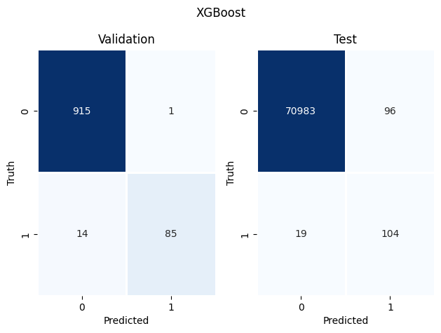
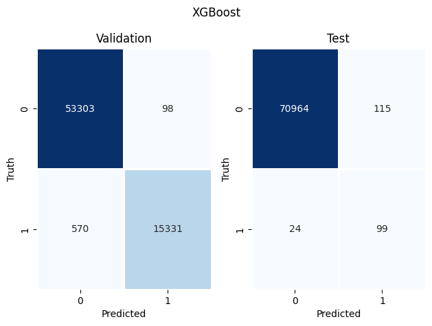
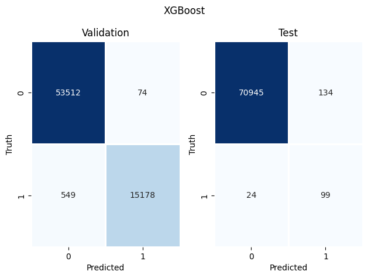

```python
import numpy as np
import pandas as pd
import matplotlib.pyplot as plt
import seaborn as sns
sns.reset_defaults()
```

### **Import Training and Testing set**

*We will use SMOTE balanced dataset for the purpose of tunning the hyperparameters* 


```python
train_smote = pd.read_pickle("data/train_smote.pickle")
test = pd.read_pickle("data/test.pickle")
```

### **Split Attributes and Target Class**


```python
x = train_smote.iloc[:, :-1]
y = train_smote["Class"]
```

### **Split training and validation set**


```python
from sklearn.model_selection import train_test_split
xtrain, xvalid, ytrain, yvalid = train_test_split(x, y, test_size=0.25, stratify=y,random_state=123)
```

### **Xgboost**

*Xgboost stands for `Extreme Gradient Boosting`. Xgboost is highly scalable and uses distributed 
gradient boosted decision trees for fitting the data*


```python
from xgboost import XGBClassifier
from sklearn.metrics import roc_auc_score
```

### **Tunning Hyperparameters**

*We need to tune parameters to gain maximum accuracy for classification. We will use optuna framework to tune
our parameters. Parameters that needed to be tuned include*
1. n_estimators
2. subsample
3. lambda
4. gamma


```python
def optimize(trial):
    params = {
        "objective": "binary:logistic",
        "eval_metric": "auc",
        "n_estimators": trial.suggest_int("n_estimators", 200, 500),
        "subsample":trial.suggest_float("subsample", 0.5, 1.0),
        "lambda": trial.suggest_float("lambda", 0.01, 1.0),
        "gamma": trial.suggest_float("gamma", 0.01, 10.0),
        "n_jobs": -1
    }
    xgb = XGBClassifier(**params, use_label_encoder=False)
    xgb.fit(xtrain, ytrain)
    ypred = xgb.predict(xvalid)
    auc = roc_auc_score(yvalid, ypred)
    return auc
```


```python
import optuna
study = optuna.create_study(direction="maximize")
study.optimize(optimize,n_trials=20 )
```

    [I 2022-08-21 18:31:02,454] A new study created in memory with name: no-name-0c785ee3-133a-4b93-90f0-1352a3688e67
    [I 2022-08-21 18:32:02,604] Trial 0 finished with value: 0.9997405095384468 and parameters: {'n_estimators': 230, 'subsample': 0.6164480175191673, 'lambda': 0.3041742179829454, 'gamma': 2.1314377554506563}. Best is trial 0 with value: 0.9997405095384468.
    [I 2022-08-21 18:34:44,141] Trial 1 finished with value: 0.9996154530676258 and parameters: {'n_estimators': 488, 'subsample': 0.7079435658931488, 'lambda': 0.6939114464563968, 'gamma': 9.865239829458273}. Best is trial 0 with value: 0.9997405095384468.
    [I 2022-08-21 18:37:59,338] Trial 2 finished with value: 0.9995591791512333 and parameters: {'n_estimators': 478, 'subsample': 0.9198617845457258, 'lambda': 0.17596762535633803, 'gamma': 7.497938835169066}. Best is trial 0 with value: 0.9997405095384468.
    [I 2022-08-21 18:39:50,308] Trial 3 finished with value: 0.9995716842705 and parameters: {'n_estimators': 288, 'subsample': 0.8098201424924678, 'lambda': 0.6820211734021447, 'gamma': 8.690270474155547}. Best is trial 0 with value: 0.9997405095384468.
    [I 2022-08-21 18:41:37,332] Trial 4 finished with value: 0.9998030368941648 and parameters: {'n_estimators': 434, 'subsample': 0.5068253993709195, 'lambda': 0.2703997832299858, 'gamma': 0.31592456091974563}. Best is trial 4 with value: 0.9998030368941648.
    [I 2022-08-21 18:43:32,783] Trial 5 finished with value: 0.9998155420134316 and parameters: {'n_estimators': 351, 'subsample': 0.5611061739216722, 'lambda': 0.3650805825328206, 'gamma': 1.5050128646853844}. Best is trial 5 with value: 0.9998155420134316.
    [I 2022-08-21 18:46:15,415] Trial 6 finished with value: 0.99964984434484 and parameters: {'n_estimators': 346, 'subsample': 0.985878415312337, 'lambda': 0.09847968287844189, 'gamma': 4.690205116976151}. Best is trial 5 with value: 0.9998155420134316.
    [I 2022-08-21 18:49:07,783] Trial 7 finished with value: 0.9995122827547525 and parameters: {'n_estimators': 432, 'subsample': 0.7489334842299782, 'lambda': 0.9774260178119292, 'gamma': 9.480249198083055}. Best is trial 5 with value: 0.9998155420134316.
    [I 2022-08-21 18:51:30,978] Trial 8 finished with value: 0.9994184917211753 and parameters: {'n_estimators': 356, 'subsample': 0.5859978310816788, 'lambda': 0.16542473748359188, 'gamma': 7.9325978705653615}. Best is trial 5 with value: 0.9998155420134316.
    [I 2022-08-21 18:53:30,740] Trial 9 finished with value: 0.9997311302591506 and parameters: {'n_estimators': 357, 'subsample': 0.7034029631730374, 'lambda': 0.13958984154329265, 'gamma': 2.0094286439134303}. Best is trial 5 with value: 0.9998155420134316.
    [I 2022-08-21 18:54:31,536] Trial 10 finished with value: 0.999624832346922 and parameters: {'n_estimators': 204, 'subsample': 0.512498013363135, 'lambda': 0.4951800374506271, 'gamma': 4.978314449408295}. Best is trial 5 with value: 0.9998155420134316.
    [I 2022-08-21 18:55:48,077] Trial 11 finished with value: 0.9998749435291793 and parameters: {'n_estimators': 415, 'subsample': 0.5111805211467851, 'lambda': 0.36873577072556835, 'gamma': 0.11732389415560096}. Best is trial 11 with value: 0.9998749435291793.
    [I 2022-08-21 18:57:36,602] Trial 12 finished with value: 0.9997748990562764 and parameters: {'n_estimators': 402, 'subsample': 0.5946742395085342, 'lambda': 0.4502587395739395, 'gamma': 0.7152637401348525}. Best is trial 11 with value: 0.9998749435291793.
    [I 2022-08-21 18:59:17,276] Trial 13 finished with value: 0.9998155420134316 and parameters: {'n_estimators': 314, 'subsample': 0.6337439633651393, 'lambda': 0.38819239085801194, 'gamma': 3.0524348487469997}. Best is trial 11 with value: 0.9998749435291793.
    [I 2022-08-21 19:01:13,541] Trial 14 finished with value: 0.9996529701848105 and parameters: {'n_estimators': 403, 'subsample': 0.5001536766597503, 'lambda': 0.6122507034119591, 'gamma': 3.3855315323537654}. Best is trial 11 with value: 0.9998749435291793.
    [I 2022-08-21 19:02:32,618] Trial 15 finished with value: 0.9998249212927277 and parameters: {'n_estimators': 274, 'subsample': 0.5646143834937423, 'lambda': 0.013148430276639866, 'gamma': 1.276975871424506}. Best is trial 11 with value: 0.9998749435291793.
    [I 2022-08-21 19:03:39,052] Trial 16 finished with value: 0.9998530591306163 and parameters: {'n_estimators': 277, 'subsample': 0.6516571400368422, 'lambda': 0.9063179299237856, 'gamma': 0.053088008475354886}. Best is trial 11 with value: 0.9998749435291793.
    [I 2022-08-21 19:04:51,054] Trial 17 finished with value: 0.9998937020877715 and parameters: {'n_estimators': 249, 'subsample': 0.829209655978069, 'lambda': 0.9803204287458802, 'gamma': 0.06850458794611115}. Best is trial 17 with value: 0.9998937020877715.
    [I 2022-08-21 19:07:31,210] Trial 18 finished with value: 0.9996404650655439 and parameters: {'n_estimators': 393, 'subsample': 0.8441801440559984, 'lambda': 0.8254961762405818, 'gamma': 5.990048492143102}. Best is trial 17 with value: 0.9998937020877715.
    [I 2022-08-21 19:09:09,441] Trial 19 finished with value: 0.9995810635497963 and parameters: {'n_estimators': 243, 'subsample': 0.8452205868699615, 'lambda': 0.5619974038181069, 'gamma': 3.741430579202208}. Best is trial 17 with value: 0.9998937020877715.


### **Fitting model**

*We implement function that fits the data with specific hyperparameters to the Xgboost model and then 
prints the precision recall for target classes in test set with the confusion matrix of validation and 
test set*


```python
from sklearn.metrics import classification_report, confusion_matrix
```


```python
def xgb_fit(train_set):
    xtrain, xvalid, ytrain, yvalid = train_test_split(train_set.iloc[:,:-1], train_set["Class"], test_size=0.25, random_state=123)
    xgb = XGBClassifier(objective="binary:logistic",
                        eval_metric="auc",
                        n_estimators=200, 
                        subsample=0.70, 
                        eta=0.01, 
                        gamma=0.01, 
                        n_jobs=-1, 
                        use_label_encoder=False)
    xgb.fit(xtrain, ytrain)
    v_pred = xgb.predict(xvalid)
    y_pred = xgb.predict(test.iloc[:,:-1])
    vcm = confusion_matrix(yvalid,v_pred)
    ycm = confusion_matrix(test["Class"], y_pred)
    fig , axes = plt.subplots(1,2)
    fig1 = sns.heatmap(vcm, cmap="Blues", linewidths=0.9, cbar=False, annot=True, fmt ="d",ax=axes[0])
    fig2 = sns.heatmap(ycm, cmap="Blues", linewidths=0.9, cbar=False, annot=True, fmt ="d",ax=axes[1])
    fig1.set(xlabel="Predicted", ylabel="Truth")
    fig1.set_title("Validation")
    fig2.set(xlabel="Predicted", ylabel="Truth")
    fig2.set_title("Test")
    fig.suptitle("XGBoost")
    plt.tight_layout()
    print(classification_report(test["Class"], y_pred))
```

### **Undersampling**


```python
train_under = pd.read_pickle("data/train_under.pickle")
xgb_fit(train_under)
```

                  precision    recall  f1-score   support
    
               0       1.00      1.00      1.00     71079
               1       0.52      0.85      0.64       123
    
        accuracy                           1.00     71202
       macro avg       0.76      0.92      0.82     71202
    weighted avg       1.00      1.00      1.00     71202
    





### **Bootstrap Sampling**


```python
train_over = pd.read_pickle("data/train_over.pickle")
xgb_fit(train_over)
```

                  precision    recall  f1-score   support
    
               0       1.00      1.00      1.00     71079
               1       0.63      0.78      0.70       123
    
        accuracy                           1.00     71202
       macro avg       0.81      0.89      0.85     71202
    weighted avg       1.00      1.00      1.00     71202
    


### **Oversampling with shrinkage**


```python
train_over_shrink = pd.read_pickle("data/train_over_shrink.pickle")
xgb_fit(train_over_shrink)
```

                  precision    recall  f1-score   support
    
               0       1.00      1.00      1.00     71079
               1       0.42      0.84      0.56       123
    
        accuracy                           1.00     71202
       macro avg       0.71      0.92      0.78     71202
    weighted avg       1.00      1.00      1.00     71202
    


### **SMOTE**


```python
xgb_fit(train_smote)
```

                  precision    recall  f1-score   support
    
               0       1.00      1.00      1.00     71079
               1       0.46      0.80      0.59       123
    
        accuracy                           1.00     71202
       macro avg       0.73      0.90      0.79     71202
    weighted avg       1.00      1.00      1.00     71202
    





### **ADASYN**


```python
train_adasyn = pd.read_pickle("data/train_adasyn.pickle")
xgb_fit(train_adasyn)
```

                  precision    recall  f1-score   support
    
               0       1.00      1.00      1.00     71079
               1       0.42      0.80      0.56       123
    
        accuracy                           1.00     71202
       macro avg       0.71      0.90      0.78     71202
    weighted avg       1.00      1.00      1.00     71202
    





### **Save Model**


```python
xtrain = train_over_shrink.iloc[:, :-1].to_numpy()
ytrain = train_over_shrink["Class"].to_numpy()
xgb = XGBClassifier(objective="binary:logistic",
                        eval_metric="auc",
                        n_estimators=200, 
                        subsample=0.70, 
                        eta=0.01, 
                        gamma=0.01, 
                        n_jobs=-1, 
                        use_label_encoder=False)
xgb.fit(xtrain, ytrain)
```


```python
import joblib
joblib.dump(xgb, "models/xgb.pkl")
```

    ['models/xgb.pkl']


```python

```
